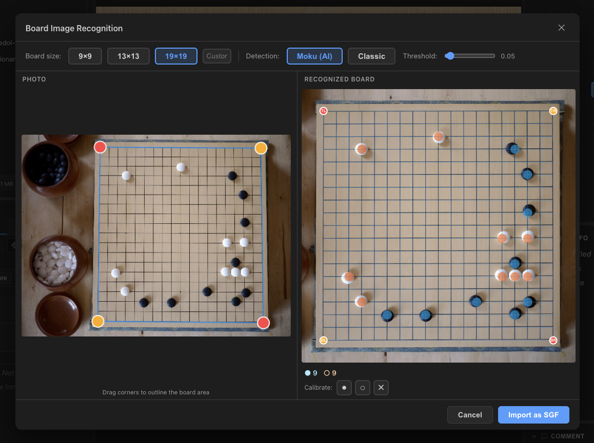

# Kaya

**Play, study, and analyze Go — right from your browser or desktop.**

Kaya is a free, open-source Go (Baduk/Weiqi) application with AI-powered analysis, board recognition from photos, and a beautiful modern interface. Available on **Windows**, **macOS**, **Linux**, and the **Web**.

 

---

## ✨ Features

<table>
<tr>
<td width="50%">

**Game & Study**

- 🎯 Complete Go rules on 9×9, 13×13, and 19×19 boards
- 🌳 Visual game tree with variation support
- 📄 SGF import/export, drag & drop, OGS URL import
- ✏️ Edit mode with stones, markers, labels, and annotations
- 📚 Game library — organize games in folders
- 🎯 Score estimation with interactive dead stone marking

</td>
<td width="50%">

**AI & Analysis**

- 🤖 Live win rate, move suggestions, and full game analysis (KataGo via ONNX)
- 📊 Analysis graph with move quality colors
- 🗺️ Ownership heatmap for territory visualization

**Board Recognition**

- 📷 Snap a photo of a real board → get a playable SGF
- 🧠 Powered by Moku AI (RT-DETR model)

</td>
</tr>
</table>

 
<em>Board recognition: snap a photo of any Go board and import it instantly</em>

### More

- 🎮 Keyboard shortcuts, gamepad support, mouse wheel navigation
- 🎨 6 board themes + dark/light mode
- 🌍 8 languages (EN, ZH, KO, JA, FR, DE, ES, IT)
- 📱 Responsive on mobile, tablet, and desktop

### Platform Support

- 🖥️ **Desktop** — Native performance on Windows, macOS, and Linux via [Tauri](https://tauri.app)
- 🌐 **Web** — Play directly in your browser (works on mobile and tablet too)
  - [**Stable**](https://kayago.app) — Latest official release
  - [**Next**](https://kayago.app/next/) — Built from `main` branch (newest features)
- 📱 **PWA** — Install the web app on any device for offline use (no app store needed)

---

## 🚀 Get Started

| Platform       | How                                                                     |
| -------------- | ----------------------------------------------------------------------- |
| 🌐 **Web**     | **[Open kayago.app](https://kayago.app)** — nothing to install          |
| 🪟 **Windows** | [Download `.exe`](https://github.com/kaya-go/kaya/releases/latest)      |
| 🍎 **macOS**   | [Download `.dmg`](https://github.com/kaya-go/kaya/releases/latest)      |
| 🐧 **Linux**   | [Download `.AppImage`](https://github.com/kaya-go/kaya/releases/latest) |

---

## 🛠️ Tech Stack

| Layer                 | Technology                                                         |
| --------------------- | ------------------------------------------------------------------ |
| **Frontend**          | React 19 + TypeScript 5 + Rsbuild                                  |
| **Desktop**           | [Tauri v2](https://tauri.app) (Rust backend)                       |
| **AI**                | [KataGo](https://github.com/lightvector/KataGo) via ONNX Runtime   |
| **Board Recognition** | Moku AI (RT-DETR) + classic CV pipeline                            |
| **Build**             | [Bun](https://bun.sh) workspaces (monorepo, 14 packages)           |
| **Go logic**          | TypeScript ports from [Sabaki](https://github.com/SabakiHQ/Sabaki) |

---

## 🤝 Contributing

Contributions are welcome — bug reports, feature ideas, or code!

- 🐛 [Report a bug](https://github.com/kaya-go/kaya/issues/new?template=bug_report.md)
- 💡 [Suggest a feature](https://github.com/kaya-go/kaya/issues/new?template=feature_request.md)
- 🛠️ [Contributing guide](CONTRIBUTING.md)

---

## 📜 License

[AGPL-3.0](LICENSE) © 2025-2026 [Hadim](https://github.com/hadim)

---

## 🙏 Acknowledgments

- **[Sabaki](https://github.com/SabakiHQ/Sabaki)** — Core Go libraries and inspiration
- **[Tauri](https://tauri.app)** — Lightweight desktop framework
- **[KataGo](https://github.com/lightvector/KataGo)** — AI analysis engine

---

**"Kaya" (榧) — the Japanese nutmeg tree, whose wood makes the finest Go boards.**

Made with ❤️ for the Go community

[⬆ Back to top](#kaya)

